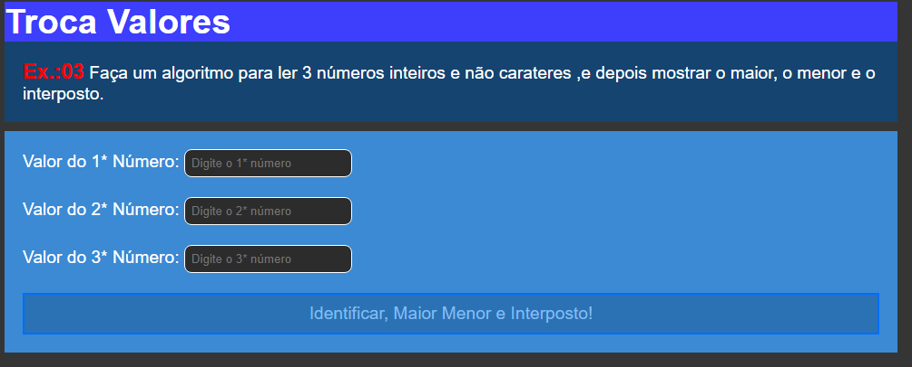

# Troca Valores

Este projeto foi desenvolvido para fins de exreícios em `Javascript`. Como o nome diz o projeto tem a função de trocar valores, o projeto possui três `campo` de entreda de `valores` e um `botão` o `usuario` vai digitar três valores de lembrar que nenhum dos campos tem que estar vazio se não vai gerar `erro`, se não for o caso assim que o usuario clicar no `botão` `identificar o maior menor e intermédio` o sistema vai `retornar` de acordo com os valores digitados o maior e menor número e também o intermédio ou seja o número que estiver no intervalo entre o maior e menor número..😊😎

## Tecnologias

As seguintes ferramentas foram usadas para constuição deste projeto:

- HTML
- CSS
- JAVASCRIPT

#

Feito por ❤ Pascoal Kahamba meu [Linkedin](https://www.linkedin.com/in/pascoal-kahamba-7b43bb233?lipi=urn%3Ali%3Apage%3Ad_flagship3_profile_view_base_contact_details%3BTg8LEKayToyytOX1pVAQ%2Bg%3D%3D)

[👉Clique aqui se deseja ver a aplicação rodando!👈😎](https://troca-valores.vercel.app/)
